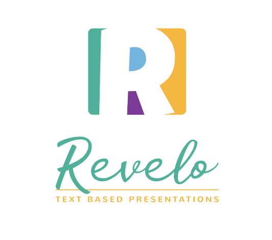

->wait[8000]
->background-color[white]
->background-video[beaches,0.9]

<(height="200")>

Revelo <(.f1 .white)>

Is a tool for creating **presentations**<(.blue)> using simple text files,
based on syntax conventions

---
->wait[2000]
->background-color[black]
->background-video[happy people-2,0.5]
->transition[zoom]

## It allows you to:
:::{incremental}
- focus on your contents first <(.pink)>
- create cool presentations on the fly :-D
- generate dynamic presentations from different datasources
- help people with dishabilities create beautiful presentations
:::

---
->wait[1500]
->background-color[black]
->background-video[notebook-5,0.4]

## How it works:
:::{incremental}
- first you create a text file <(.underline .yellow)>
- launch using: *npx revelo server yourfile.txt*<(.blue)>
- save and see your changes in *realtime*<(.yellow)>
- separate each slide with 3 dashes
- you can also use markdown syntax if you know it
::: 

with an image <(.light-blue)>

<(height="100")>

---
# with embeded youtube video

@[youtube](ez_70v8PEgI)

---
# The end
->wait[3000]
